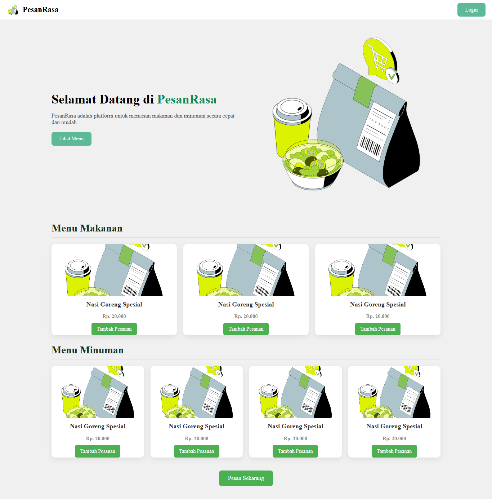
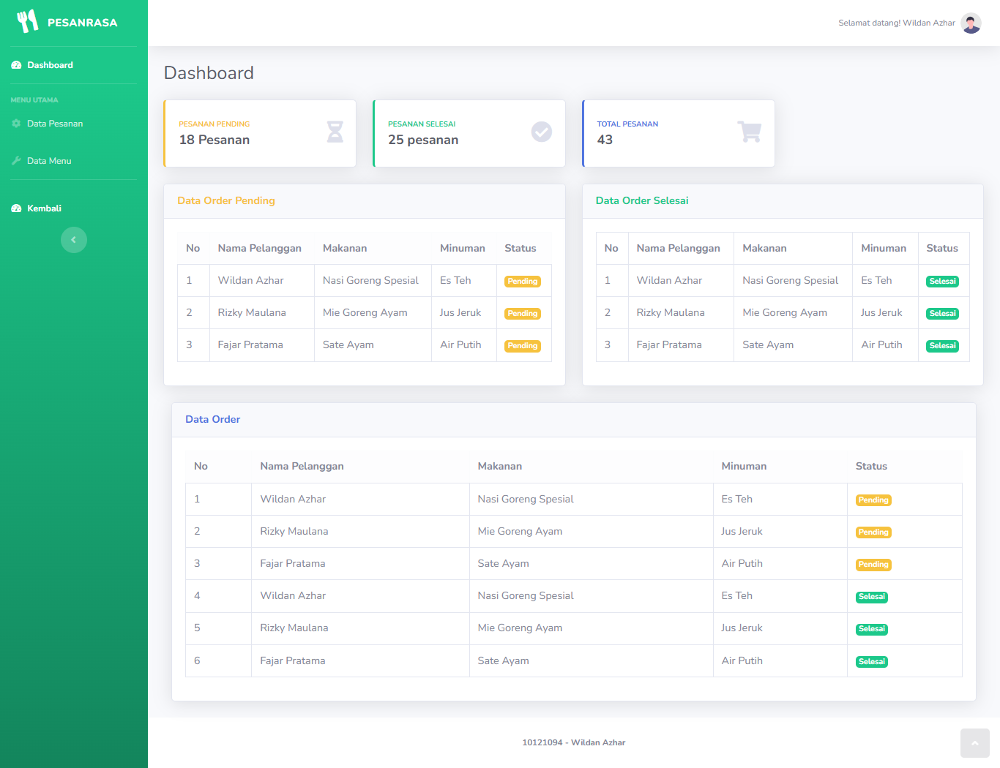

# 🍽️ PesanRasa

**PesanRasa** adalah sebuah aplikasi web sederhana untuk melakukan pemesanan makanan dan minuman secara cepat, mudah, dan efisien. Aplikasi ini cocok digunakan untuk keperluan restoran kecil, kantin, atau sebagai latihan proyek pemula untuk web development.

---

## 🖼️ Tampilan Utama




---

## 🚀 Fitur Utama

### 👤 Halaman Pengguna
- Menampilkan daftar **menu makanan** dan **menu minuman**.
- Tombol **"Tambah Pesanan"** untuk menambahkan ke daftar pesanan.
- Tombol **"Pesan Sekarang"** untuk konfirmasi pesanan.

### 🔐 Halaman Admin
- Login admin.
- Sidebar navigasi: Dashboard, Data Pesanan, Data Menu.
- Dashboard menampilkan:
  - Jumlah pesanan **pending** & **selesai**.
  - Tabel pesanan berdasarkan **status** (pending/selesai).
- Admin dapat **mengubah status pesanan** dari pending ke selesai.
- Halaman Data Pesanan menampilkan seluruh data tanpa filter status.

---

## 🛠️ Teknologi yang Digunakan

- **Frontend:** HTML, CSS, Bootstrap
- **Backend:** PHP (Native)
- **Database:** MySQL
- **Icon & UI:** FontAwesome

---

## 📂 Struktur Folder

---

## 🧑‍💻 Instalasi Lokal
1. **Clone Repository**
   ```bash
   git clone https://github.com/username/pesanrasa.git
   cd pesanrasa

2. **Aktifkan Apache dan Sql pada XAMPP**

3. **Import Database**
   - Pada folder database ambil **pesanrasa.sql**
   - kemudian masuk ke phpmyadmin dan import database

4. **Pastikan koneksi database**
   - Pastikan **$conn** pada file **koneksi_crud.php** sesuai dengan database
     
5. **Jalankan Web**
   - Setelah langkah - langkah sebelumnya dilakukan maka jalankan web dengan menggunakan **localhost/CRUD_WEB/index.php**


## Penulis
** Nama : Wildan Azhar **


